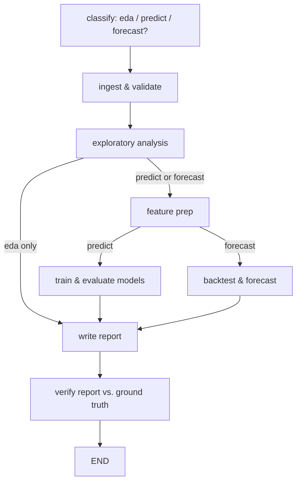
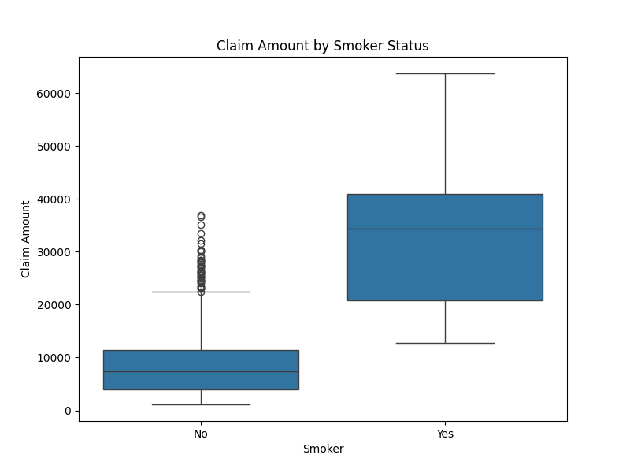

# Agentic Data Analyst

An agent that takes a raw CSV and a plain-English question, decides for itself
whether the job is exploration, supervised prediction, or forecasting, then
runs the right analysis in a live Python sandbox and hands back a
self-contained HTML report — plots, metrics, and a verification pass included.

## The problem

The first version of this project was a single 100-line script: one
`create_agent` ReAct loop, one `run_python` tool against an E2B sandbox, one
giant 5-phase system prompt, and `print(result)` as the only output. It
worked, but:
- nothing survived the run except stdout and stray PNGs — the actual report
  lived inside a LangChain message object that got printed and discarded;
- every tool call's full history was resent to the model on every turn, with
  no truncation, no state contract, no way to check "did it actually compute
  what it claims";
- there was one run, on one dataset, that didn't even match the task it was
  given — no way to tell if a prompt change made things better or worse.

## Why an agentic approach at all

Data analysis is a good fit for the **code-execution agent** pattern (the
same idea behind Open Interpreter / ChatGPT's Code Interpreter): rather than
asking an LLM to *describe* an analysis, give it a real Python kernel and let
it write and run the code, read the actual output, and iterate. The
interesting engineering problem isn't "can the model write pandas code" — it's
**boundaries and contracts**: deciding what each step is allowed to see, what
it's required to produce, and how you'd know if it's wrong.

## Architecture

The five analysis phases are explicit LangGraph nodes instead of one prompt
hoping the model moves through them in order. Task classification is a real
conditional edge, not a suggestion buried in a system prompt.



Each node (`graph.py`) runs its own small, phase-scoped agent (`agent.py`) —
its own tiny message history (base rules + phase prompt + current state
summary), not the whole run's transcript — against a shared, persistent E2B
sandbox (`sandbox.py`). Every node reads/writes a single typed state object
(`schema.py: AnalysisState`), which is what gets validated and dumped as
`outputs/<run_id>/state.json`. Nothing in the final report is allowed to come
from anywhere except that state.

| Module | Responsibility |
|---|---|
| `config.py` | All configuration (dataset path, model, run limits, keys) from env/CLI — nothing hardcoded |
| `schema.py` | Pydantic `AnalysisState`, `ModelResult`, `CostReport` — the data contract every node writes into |
| `sandbox.py` | E2B lifecycle, `run_python` tool, plot + `state.json` pull-back |
| `agent.py` | Builds the phase-scoped ReAct agent each node runs |
| `graph.py` | The LangGraph wiring above |
| `verifier.py` | Second LLM pass: checks the report's numeric claims against `AnalysisState` |
| `cost.py` | Per-node token usage + wall-clock + sandbox-seconds |
| `report.py` | Assembles one self-contained HTML file (report + embedded plots + metrics + verification + cost) |
| `main.py` | CLI entrypoint / `run_pipeline()` used by both the CLI and the Streamlit app |
| `prompts/*.md` | One prompt fragment per node, sharing `base_rules.md` |
| `eval/` | Benchmark datasets + pass/fail harness (see below) |

### Verification, not just generation

After the report is written, `verifier.py` makes one extra no-tools LLM call:
given the report text and the ground-truth `models_tried`/`forecast`/
`eda_findings` from `state.json`, it flags any numeric claim that doesn't
trace back to real data. This is a soft **LLM-as-judge** check — cheap, and
it catches the most common failure mode of report-writing agents
(confidently restating a number that was never actually computed).

### Cost/latency instrumentation

Every node's wall-clock time and token usage is tracked (`cost.py`) and shown
in the final report and in eval output — so "how much did this run cost" is
answered, not guessed.

## Example run

Ask it to model insurance charges from `datasets/insurance.csv`. The run
produces `outputs/<run_id>/report.html` — a single file with the markdown
report, every plot the agent generated embedded as base64 (no external file
refs, so it's shareable standalone), a metrics table, the verification
section, and a cost breakdown.

## Example output

A real run on `datasets/insurance.csv` (`predict` branch) produces plots like
this one, generated and saved by the agent itself during EDA:



...alongside a metrics table comparing every model tried:

| Model                    | RMSE on Test Set |
|---------------------------|------------------|
| Mean Predictor (baseline) | 12830.81         |
| Linear Regression         | 12356.45         |
| Random Forest Regressor   | 13933.33         |

...and a verification section confirming every number in the report traces
back to real computed results:

```
Verification: OK — no discrepancies found.
```

All of this — the markdown report, embedded plots, metrics table,
verification, and a per-node cost/latency breakdown — ships as one
self-contained `report.html` file.

## Evaluation

`eval/` is a tiny but real benchmark: three synthetic, deterministically
generated datasets, one per pipeline branch (`eval/make_datasets.py`):

| Dataset | Expected branch | What's checked |
|---|---|---|
| `eda_survey.csv` | `eda` | correct classification, valid `state.json` |
| `insurance_like.csv` | `predict` (regression) | classification, valid state, best model beats the naive mean-predictor baseline |
| `daily_sales.csv` | `forecast` (time series) | classification, valid state, best model beats a naive-forecast baseline on the backtest window |

Run it with:

```bash
python -m eval.run_eval
```

This makes real OpenAI + E2B calls, and writes a pass/fail-per-case summary to
`eval/results.json` — useful for checking a prompt or model change hasn't
regressed task classification or model quality, instead of eyeballing one run.

## Limitations (by design, not bugs)

- **Forecasting on non-temporal data is out of scope** — the `classify` node
  requires a time dimension before routing to `model_forecast`; a dataset
  without one is routed to `eda` or `predict` instead, and the report says so.
  (This is exactly the mismatch the original single-script version had: it
  was asked to forecast a non-temporal insurance dataset and just complied.)
- The verifier checks *numeric consistency*, not *statistical correctness* —
  it won't catch a p-hacked correlation, only a hallucinated one.
- Each node's tool-call budget (`RUN_LIMIT_PER_NODE`, default 6) is a hard
  cap; a very messy dataset can exhaust it mid-phase.
- No persistence/checkpointing across runs yet — each run is one-shot. A
  planner/executor split, cross-run memory, and an adversarial "debate" stage
  (second perspective agent + judge) are natural next steps once this is
  stable.

## Running it

```bash
cp .env.example .env   # fill in OPENAI_API_KEY and E2B_API_KEY
# Note: running this makes real OpenAI + E2B API calls billed to your own account.
pip install -r requirements.txt

# CLI
python main.py --dataset datasets/insurance.csv \
  --question "Predict insurance claim amount from age, bmi, smoker status, and region"

# Streamlit demo
streamlit run streamlit_app.py

# Eval harness
python -m eval.run_eval

# Docker
docker build -t agentic-data-analyst .
docker run --env-file .env -p 8501:8501 agentic-data-analyst
```

## License

MIT — see [LICENSE](LICENSE).
